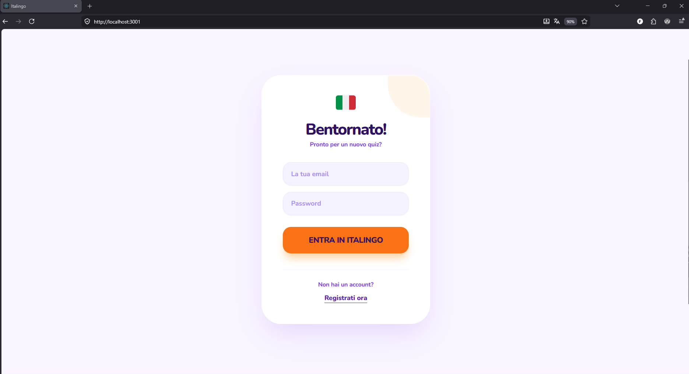
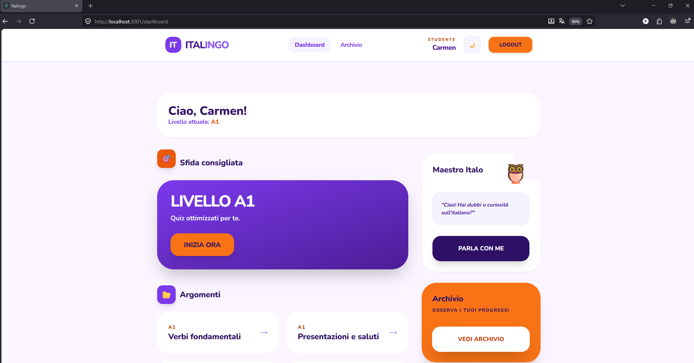
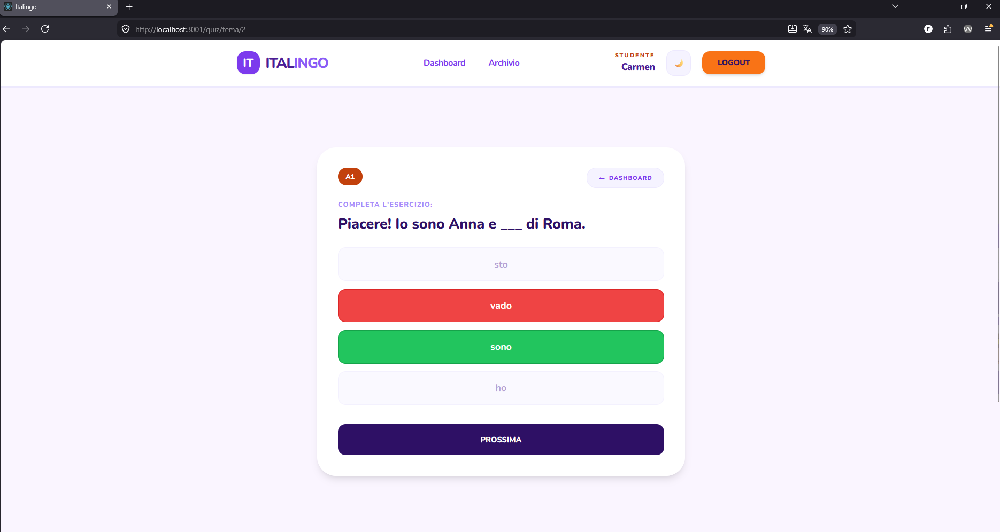
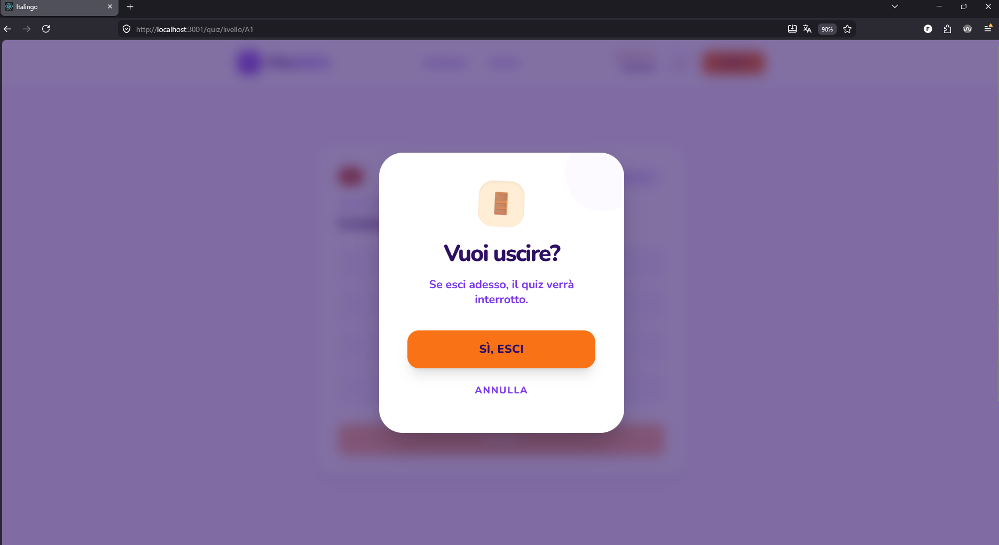
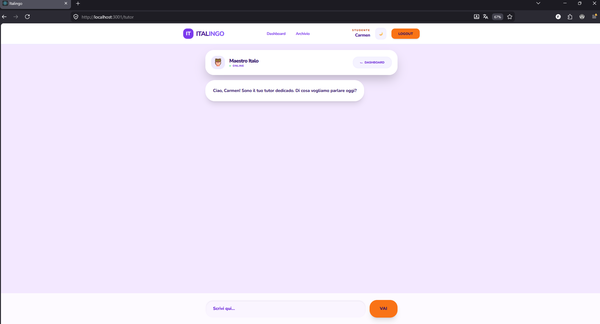
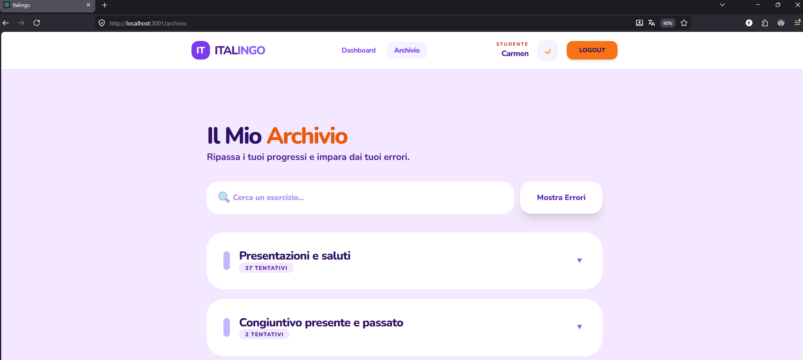

# 🇮🇹 Italingo - Plataforma Full-Stack para el Aprendizaje de Italiano L2 con Tutor IA

¡Bienvenido/a al espacio de presentación de **Italingo**! Este repositorio actúa como la ficha técnica y demostrativa de una aplicación web Full-Stack real orientada a la enseñanza del italiano como segunda lengua (L2). 

> 🔒 **Nota sobre el código fuente:** Al tratarse de un proyecto con fines comerciales y de despliegue profesional para alumnos reales, el código fuente completo se mantiene en un repositorio privado para proteger la propiedad intelectual, la lógica de negocio y la seguridad del sistema. Sin embargo, a continuación se detalla toda su arquitectura, diseño y funcionamiento.

---

## 📺 Demostración en Capturas

### 📸 Vistas de la Aplicación
| Pantalla de Acceso |
|  | 

|Panel de Lecciones | 
|  | 

| Quiz | 
|  | 

|Ventana Emergente | 
|  | 
| Tutor IA | 

|  | 
| Archivo | |  |

---

## 🛠️ Arquitectura Técnica y Stack Tecnológico

La plataforma se ha diseñado siguiendo los estándares modernos de desarrollo desacoplado, separando completamente las responsabilidades del Frontend y el Backend a través de una API RESTful.

* **Frontend (SPA):** Desarrollado con **React** y **Vite**. Renderizado dinámico de componentes, navegación instantánea sin recargas de página, gestión reactiva del estado y consumo asíncrono de servicios.
* **Backend:** Desarrollado con **Node.js** y **Express**. Encargado de la lógica de negocio, control del flujo de datos, enrutamiento de la API y orquestación con servicios de Inteligencia Artificial de terceros.
* **Base de Datos:** **MySQL**. Modelo relacional estructurado y normalizado para gestionar de forma eficiente usuarios, lecciones, preguntas y el histórico de progreso guardado en el *Archivio*.
* **Diseño y Estilos:** **Tailwind CSS**. Arquitectura visual moderna, limpia y construida bajo el principio de utilidad, garantizando fluidez y consistencia estética.

---

## 🚀 Desafíos Técnicos y Soluciones Implementadas

Como desarrolladora Full-Stack, el diseño de Italingo me ha permitido enfrentarme a retos reales de ingeniería de software y experiencia de usuario:

1. **Integración de Tutoría Inteligente en Tiempo Real (API Mistral AI):** El mayor reto conceptual fue dotar a la app de un feedback pedagógico inmediato. Al fallar un ejercicio, el backend se conecta dinámicamente con la API de Mistral AI, procesa el error del alumno y genera una explicación en español adaptada al contexto del fallo.
2. **Inclusión, Accesibilidad (A11Y) y UX:** Tras realizar auditorías de contraste con herramientas como WAVE, la interfaz se optimizó para personas con visibilidad reducida. Además, se implementó navegación por teclado completa mediante foco de anillo dinámico, atajos globales (como cerrar modales con la tecla `Escape`) y un *Focus Trap* estricto en ventanas emergentes.
3. **Persistencia y Adaptabilidad Visual:** Se integró un interruptor de **Modo Noche** global que responde de forma instantánea. Para evitar la fatiga visual del estudiante, el tema se almacena de forma persistente en el `localStorage` del navegador, manteniendo la coherencia estética entre recargas de página (F5) durante la sesión activa.
4. **Diseño Responsive Avanzado:** Utilizando las utilidades elásticas de Tailwind, los menús complejos (como los enlaces del *Footer*) y los contenedores de los Quizzes mutan de estructura automáticamente. Cambian de filas horizontales en escritorio a listas verticales adaptadas a pantallas táctiles de móviles y tablets.

---

## 💡 Perfil Dual: Tecnología y Docencia

Italingo no es solo un proyecto técnico de fin de ciclo (**DAW**); es la fusión de mi perfil como **Desarrolladora Web** y mi formación como **Linguista** y **Docente de Italiano L2**. Toda la lógica pedagógica, la dosificación de los niveles y el diseño de los ejercicios interactivos han sido estructurados bajo criterios metodológicos reales de enseñanza de idiomas, aportando un valor único en el mercado *EdTech*.

---

_Proyecto desarrollado con 💻 y 👩‍🏫 como proyecto final del ciclo de Grado Superior en Desarrollo de Aplicaciones Web (DAW)._
